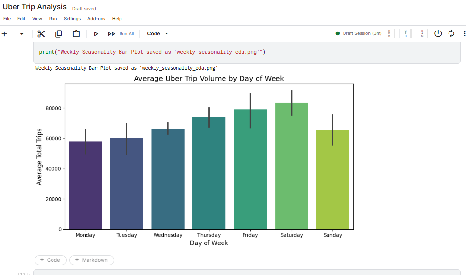

# 🚕 Uber Trip Analysis & Demand Forecasting

This project analyzes Uber trip patterns in New York City and builds data-driven insights for demand forecasting.  
It includes data cleaning, exploratory analysis, and visualizations to understand how demand changes by time, day, and month.

## 📌 Project Summary

This project focuses on analyzing and forecasting Uber trip demand in New York City using real-world taxi trip data.  
It aims to understand rider behavior, uncover demand patterns, and provide insights that can help with driver allocation, pricing strategies, and operational planning.

The analysis covers:

- Cleaning and preparing 4.5M+ trip records  
- Exploring trip volumes across hours, days, and months  
- Identifying demand hotspots and peak time windows  
- Visualizing patterns through charts and heatmaps  
- Understanding seasonality and usage trends

## 📂 Repository Structure

## 📊 Project Overview

- Performed exploratory data analysis on *NYC taxi trip records*
- Cleaned missing values, incorrect entries, and outliers
- Identified *peak hours, **busy days, and **monthly demand trends*
- Analyzed travel patterns like:
  - trip distances  
  - pickup-drop distributions  
  - passenger counts  

---

## 🖼 Visual Insights

---

## 📁 Files Included

- *notebooks/uber-trip-analysis.ipynb* — Full exploratory analysis
- *data/Uber-Jan-Feb-FOIL.csv* — Trip dataset
- *screenshots/* — Add your EDA graphs or charts

---

## ⭐ Key Skills Demonstrated

- Data Cleaning & Preparation  
- Exploratory Data Analysis (EDA)  
- Visualization (Matplotlib / Seaborn)  
- Time-Series Pattern Understanding  
- Working with large-scale datasets  
- Professional project structuring  

---

## 🙋‍♀️ Author

*Ruchi Hashwani*  
📌 Data Analyst | BI & ML Enthusiast

